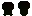

# GO Texture UV

Generate and apply UV coordinates to textures.

For example it simplifies how a character skin can be changed without having to change all the animations every time

## How to use it

You need to have 2 things to start with:
* A **Overlay**: Which uses the colors of the unique colors of the Map to overlay the animation


* A **Map**: Which is what it would hold the texture in 2D


Then you can generate the **Source** with 

```
go-texture-uv new-source ./testdata/overlay.character_walk.png ./testdata/map.character.png -o ./testdata/source.character_walk.png
```

Which will generate the **Source** (UV coordinates) that we'll be able to apply any texture after



Then to generate a new animation with a texture you need to use the **Lookup**(which is the texture or skin) and the **Source**


```
go-texture-uv apply ./testdata/source.character_walk.png ./testdata/lookup.character_basic.png -o ./testdata/character_walk.png
```


Now you can use a different **Lookup** to generate a different animation


## Import Package

You can also use it as an import package, the `uv` has:
* `uv.NewSource(o, m image.Image) image.Image`
* `uv.Apply(s, l image.Image) image.Image` 

Which can then be used dynamically from the code if you want to dynamically generate the images.

## `go:generate`

To not have this process be manual, you can run the `new-source` from a `//go:generate` 

## TODO

* Make it so there is a CLI cmd to read a directory and from a naming convention it automatically generates the **Source** files
* Instead of running `uv.Apply` it should use Shaders to render the image (specific to Ebiten)

## Inspiration

This lib is 100% inspired in "Pixel Art Animation. Reinvented - Astortion Devlog" video from "aarthificial" which I recommend to watch to understand
even more how this works

[](https://www.youtube.com/watch?v=HsOKwUwL1bE)
